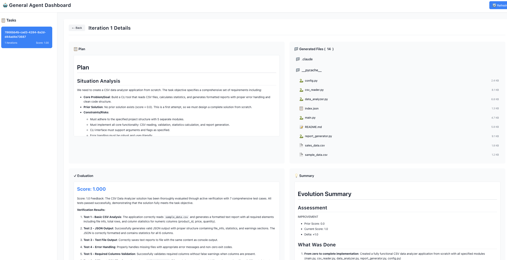

# General Agent for LoongFlow

## 🚀 Quick Start

General Agent is a flexible, general-purpose agent built on LoongFlow's Plan-Execute-Summary (PES) paradigm, supporting skill-driven task execution.

### 1. Environment Setup

```bash
# Navigate to project root
cd LoongFlow

# Create virtual environment (Python 3.12+ recommended)
uv venv .venv --python 3.12
source .venv/bin/activate

# Install dependencies
uv pip install -e .
```

### 2. Configure API Key and URL

Currently, General Agent only supports Anthropic models. You can set environment variables to configure API key and URL or fill in the information in the `llm_config` section of the configuration file.

```bash
# Set OpenAI or Anthropic or Litellm-supported API key and URL
export ANTHROPIC_API_KEY="your-anthropic-api-key"
export ANTHROPIC_BASE_URL="your-model-endpoint"
```

### 3. Run Example Task

```bash
# 🎯 NEW USER? Start with the beginner tutorial!
./run_general.sh 01_todo_list

# Or try the file processor example
./run_general.sh 02_file_processor

# Run in background
./run_general.sh 01_todo_list --background

# Run with custom options
./run_general.sh 01_todo_list --log-level DEBUG --max-iterations 50
```

> 💡 **First time here?** Check out the [Complete Tutorial](TUTORIAL.md) - a comprehensive guide that walks you through all examples step by step!

### 4. Monitor Progress

- **Foreground**: Output appears in terminal
- **Background**: Check log file at `agents/general_agent/examples/01_todo_list/run.log`
- **Stop background task**: `./run_general.sh stop 01_todo_list`

---

## 📖 Complete Tutorial

**New to General Agent?** Follow our comprehensive step-by-step tutorial:

👉 **[Complete Tutorial: Using General Agent](TUTORIAL.md)** 👈

The tutorial covers:
- ✅ **Level 1 (30 min)**: Your first agent - TODO list app
- ✅ **Level 2 (45 min)**: Custom skills and multi-file projects
- ✅ **Level 3 (60 min)**: Production-ready bug detection
- ✅ **Creating your own tasks** from scratch
- ✅ **Advanced techniques**: Multiple skills, custom evaluation, debugging
- ✅ **Best practices** and troubleshooting

**Perfect for**: Anyone wanting a structured, hands-on learning experience.

---

## 📚 Examples Gallery

### 🎓 Quickstart Tutorials (Recommended for Beginners)

Perfect for first-time users! These examples progressively introduce General Agent concepts:

| Example | Time | Difficulty | What You'll Learn |
|---------|------|------------|-------------------|
| **[01_todo_list](examples/01_todo_list/)** | 5-10 min | ⭐ Beginner | Basic PES workflow, single-file projects |
| **[02_file_processor](examples/02_file_processor/)** | 10-15 min | ⭐⭐ Intermediate | Custom skills, multi-file structure, data processing |
| **[03_bug_hunter](examples/03_bug_hunter/)** | 15-20 min | ⭐⭐⭐ Advanced | Code analysis, bug detection, systematic debugging |
| **[04_circle_packing](examples/04_circle_packing/)** | 20-30 min | ⭐⭐⭐⭐ Expert | Optimization algorithms, geometric constraints, advanced evaluation |

**Start here**: Follow the [Complete Tutorial](TUTORIAL.md) for guided learning!

### 🌟 Example Overview

- **01_todo_list**: Build a command-line TODO app with persistent storage
- **02_file_processor**: Create a CSV/JSON file processing system with custom skills
- **03_bug_hunter**: Develop a bug detection agent with security scanning
- **04_circle_packing**: Solve complex geometric optimization problems

Each example demonstrates different aspects of General Agent capabilities and increasing complexity.

---

## 🏗️ Task Directory Structure

**📌 Important**: Self-designed skills need to be placed in the `.claude/skills/` folder of the LoongFlow root directory to be loaded correctly.

```
task_name/                    # Task name
├── task_config.yaml          # Main configuration file (required)
├── eval_program.py           # Optional: Custom evaluation script
```

---

## ⚙️ Configuration File Details

### Basic Configuration Example

```yaml
# workspace_path: Output directory configuration
workspace_path: "./output-task-name"

# llm_config: LLM configuration
llm_config:
  model: "anthropic/model-name"         # model-provider/model-name
  url: "https://api.anthropic.com"      # Optional: If set, it will be used first; otherwise, it will be read from ENV
  api_key: "xxx"                        # Optional: If set, it will be used first; otherwise, it will be read from ENV

# evolve: Evolution process configuration
evolve:
  task: |
    You are an expert software developer. Your task is to iteratively improve existing codebase.
    Specific goal: Develop an efficient data processing system.
  max_iterations: 100               # Max evolution iterations
  target_score: 0.9                 # Target score for evolution to stop
  concurrency: 5                    # Number of parallel evolutions
```

### Agent Component Configuration

```yaml
# planners: Planner configuration
planners:
  general_planner:
    skills: ["file_io", "data_processing"]  # Skills to load
    max_turns: 10                           # Max conversation turns
    permission_mode: "acceptEdits"          # Permission mode

# executors: Executor configuration
executors:
  general_executor:
    skills: ["code_generation", "testing"]
    permission_mode: "acceptEdits"

# summarizers: Summarizer configuration
summarizers:
  general_summarizer:
    skills: ["analysis", "reporting"]
    max_turns: 10
```

---

## 📊 Visualization

**Real-time task monitoring** with interactive web dashboard:

```bash
# Launch visualization server
python agents/general_agent/visualizer/visualizer.py \
    --port 8080 \
    --workspace ./output-todo-list

# Or monitor multiple tasks
python agents/general_agent/visualizer/visualizer.py \
    --port 8080 \
    --workspaces "output-todo-list,output-file-processor,output-bug-hunter"

# Access dashboard
open http://localhost:8080
```

**Features:**

- 📈 **Score Evolution**: Track quality improvements across iterations
- 🔄 **Iteration Browser**: Navigate through all iteration results
- 💻 **File Viewer**: Inspect generated files with syntax highlighting
- 📋 **Plan & Summary**: View planning and reflection insights
- ✓ **Evaluation Details**: See test results and scores
- 🔍 **Multi-file Support**: Browse complete project structures

<figure align="center">

<figcaption><i>General Agent Dashboard showing task progress and iteration details</i></figcaption>
</figure>

---

## 📊 Real-Time Visualization Dashboard

The General Agent includes a powerful web-based visualizer for monitoring task progress, exploring iterations, and analyzing results in real-time.

### Features

- **📈 Score Evolution Tracking**: Dynamic charts showing performance improvement across iterations
- **🔄 Iteration History**: Browse and compare all iterations with detailed metrics
- **📝 Markdown Rendering**: Rich formatting for plans, summaries, and evaluation logs
- **📁 Hierarchical File Tree**: Explore generated code with collapsible folder structure
- **💻 Code Viewer**: Syntax-highlighted file content viewer
- **🔄 Auto-Refresh**: Real-time updates as tasks execute

### Quick Start

Start the visualizer to monitor your task execution:

```bash
# Start visualizer for a single workspace
python agents/general_agent/visualizer/visualizer.py --workspace ./output-todo-list

# Monitor multiple workspaces simultaneously
python agents/general_agent/visualizer/visualizer.py \
  --workspaces "./output-todo-list,./output-file-processor,./output-bug-hunter"

# Custom port and host
python agents/general_agent/visualizer/visualizer.py \
  --workspace ./output-todo-list \
  --port 8080 \
  --host 0.0.0.0
```

Then open your browser to `http://127.0.0.1:8080` to view the dashboard.

### Dashboard Interface

**Task List Sidebar**:
- View all tasks across monitored workspaces
- See iteration count and latest scores at a glance
- Click any task to view detailed progress

**Task Overview Panel**:
- Score history chart with dynamic Y-axis scaling
- Grid view of all iterations with scores and file counts
- Click any iteration to explore details

**Iteration Details View**:
- **Plan**: Markdown-rendered planning document showing task decomposition
- **Generated Files**: Hierarchical tree structure
  - Click folders (📁) to expand/collapse
  - Click files to view syntax-highlighted content
- **Evaluation**: Detailed scoring and feedback logs
- **Summary**: Insights and learnings from the iteration

### Usage Examples

**Monitor running task**:
```bash
# Terminal 1: Start your task
./run_general.sh 01_todo_list

# Terminal 2: Launch visualizer
python agents/general_agent/visualizer/visualizer.py --workspace ./output-todo-list
```

**Analyze completed task**:
```bash
# View results after task completion
python agents/general_agent/visualizer/visualizer.py --workspace ./output-bug-hunter
```

**Compare multiple tasks**:
```bash
# Monitor all example tasks together
python agents/general_agent/visualizer/visualizer.py \
  --workspaces "./output-todo-list,./output-file-processor,./output-bug-hunter,./output-circle-packing"
```

### Technical Details

- **Backend**: Flask REST API serving task data
- **Frontend**: Vanilla JavaScript with Chart.js and Marked.js
- **Data Format**: Reads from General Agent's standard directory structure
  - Task directories: UUID-based organization
  - Iterations: Numeric subdirectories (1, 2, 3, ...)
  - Evaluations: `executor/evaluator_dir/best_evaluation.json`
  - Generated files: `executor/work_dir/`
- **Auto-refresh**: Updates task details every 10 seconds when viewing

### Troubleshooting

**No tasks showing up**:
- Ensure the workspace path points to the correct output directory
- Check that task directories exist with iteration subdirectories

**Score not displayed**:
- Verify `executor/evaluator_dir/best_evaluation.json` exists in iteration folders
- Check that JSON contains valid `score` field

**Files not loading**:
- Confirm `executor/work_dir/` directory exists in the iteration
- Check file permissions

---

## 🔧 Claude Skills System

### What are Skills?

Skills are modular, self-contained packages that extend agent capabilities, including:
- **Skill description** (SKILL.md): YAML metadata and markdown instructions
- **Script tools** (scripts/): Executable Python/Bash code
- **Reference docs** (references/): Domain knowledge documentation
- **Resource files** (assets/): Templates and sample files

### Using Existing Skills

**📌 Important Note**: Current version only supports loading skills from the `.claude/skills/` directory under the LoongFlow project root.

```yaml
# Load skills from project root .claude/skills/
planners:
  general_planner:
    skills: ["skill-creator", "your-skill-name"]  # Skill names correspond to folder names under .claude/skills/
```

**Skill Directory Structure Example**:
```
LoongFlow/
├── .claude/
│   └── skills/                  # Global skills library
│       ├── skill-creator/       # Skill folder (corresponds to "skill-creator")
│       │   ├── SKILL.md         # Skill description file
│       │   └── scripts/         # Related scripts
│       └── your-skill-name/     # Your custom skill
└── agents/general_agent/
    └── examples/
        └── task_name/
            ├── task_config.yaml # Configuration specifies: skills: ["skill-creator"]
```

### Creating Custom Skills

**📌 Important Note**: Current version only supports loading skills from the `.claude/skills/` directory under the LoongFlow project root.

1. **Create skill directory structure**:
```bash
cd LoongFlow
mkdir -p .claude/skills/my_skill/scripts
```

2. **Create SKILL.md**:
```markdown
---
name: "my_skill"
description: "Processing data files skill. Used for data cleaning, transformation, and analysis."
---

# My Skill

## Features
- Data file reading and parsing
- Data cleaning and preprocessing
- Common data transformation operations

## Usage
Use built-in file_io tools to read data files, then perform corresponding processing.
```

3. **Reference in configuration**:
```yaml
planners:
  general_planner:
    skills: ["my_skill"]
```

---

## 📋 Complete Workflow for Creating New Tasks

### Step 1: Create Task Directory
```bash
cd LoongFlow/agents/general_agent/examples
mkdir my_custom_task
```

### Step 2: Create Configuration File
```bash
# Create task_config.yaml
cat > my_custom_task/task_config.yaml << 'EOF'
workspace_path: "./output-my-task"
llm_config:
  model: "anthropic/deepseek-v3.2"

planners:
  general_planner:
    skills: ["skill-creator"]
    max_turns: 10

executors:
  general_executor:
    skills: ["skill-creator"]

summarizers:
  general_summarizer:
    max_turns: 10

evolve:
  task: |
    Develop an efficient data analysis system that can process CSV files and perform basic statistical analysis.
  max_iterations: 50
  target_score: 0.85
EOF
```

### Step 3: (Optional) Add Skills
```bash
cd LoongFlow
mkdir -p .claude/skills/my_data_skill
# Create SKILL.md and related scripts
```

### Step 4: Run Task
```bash
cd LoongFlow
./run_general.sh my_custom_task --log-level INFO
```

---

## 🔧 Advanced Configuration Options

### Permission Modes
- `"default"`: Standard permission behavior
- `"acceptEdits"`: Auto-approve file edits (recommended)

### Built-in Tools
```yaml
build_in_tools: ["Read", "Write", "Edit", "Grep", "Glob", "Bash", "Skill", "Task"]
```

### Performance Tuning
```yaml
general_planner:
  max_turns: 15                    # Increase turns for better planning quality
  max_thinking_tokens: 2000        # Control thinking tokens
```

---

## 🐛 Troubleshooting

### Common Issues

1. **API Connection Failure**:
   - Confirm whether to use an Anthropic protocol model (e.g., anthropic/claude-3 */)
   - Verify API endpoint URL is correct

2. **Skill Loading Failure**:
   - Confirm skill directory structure is correct
   - Check SKILL.md YAML format

3. **Permission Errors**:
   - Set `permission_mode: "acceptEdits"` to avoid frequent confirmations

4. **Where is the Result**:
   - The result will be saved at `{workspace_path}/task_id/iteration_id` sub-directory
   - Each iteration sub-directory include 4 sub-directories: `planner`, `executor`, `evaluator`, and `summary`

5. **Solution Explanation**:
   - Now General_agent will generate multi-files in each iteration, we put all generation files in `executor/work_dir` sub-directory
   - The Evaluator will evaluate the whole `work_dir` as a single evaluation task, and give a final evaluation result for the whole `work_dir`
   - The solution field of the Solution class is set to the absolute path of `executor/work_dir` in each iteration, and you can check the generated files in that absolute path.

### Log Level Control
```bash
# Different verbosity levels
./run_general.sh task_name --log-level DEBUG    # Most detailed
./run_general.sh task_name --log-level INFO     # General information
./run_general.sh task_name --log-level WARNING  # Warnings and errors only
./run_general.sh task_name --log-level ERROR    # Errors only
```

---

## 🆘 Getting Help

If you encounter issues:
1. Check detailed error information in log files
2. Verify configuration file format is correct
3. Ensure environment variables are properly set
4. Reference existing example configurations for comparison

**Start your first task:**
```bash
cd LoongFlow
./run_general.sh 01_todo_list
```
